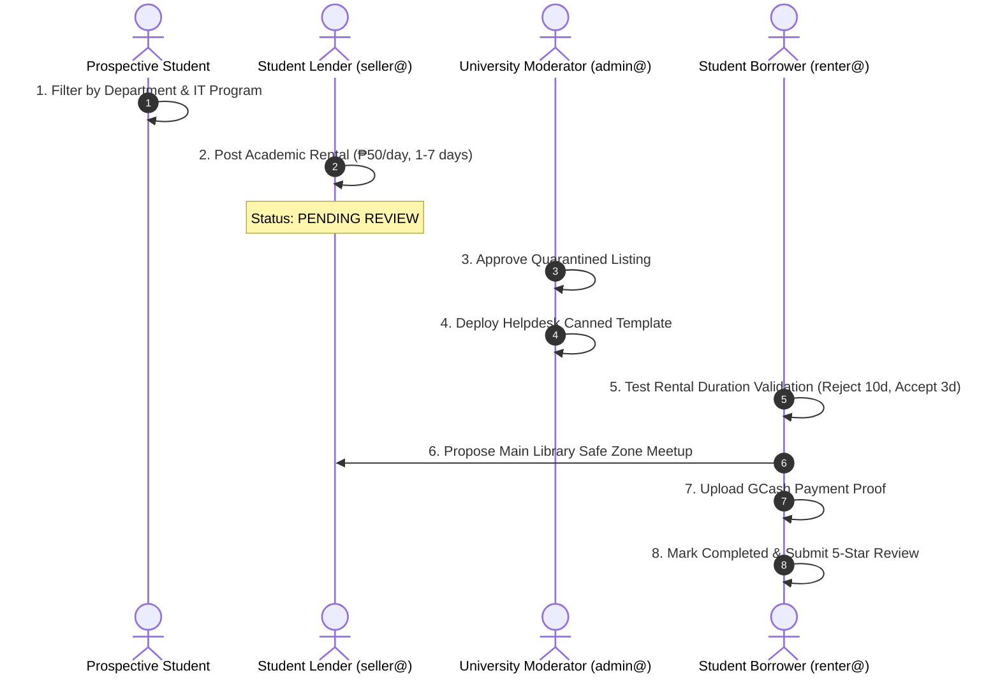

# 🎓 UM-Pasa: Final Project Defense Master Guide & Rubric Evaluation
**Course / Section:** 2032 - CCE106 · Application Development and Emerging Technologies  
**Project Title:** **UM-Pasa: Academic Peer-to-Peer Resource Marketplace & Campus Sharing Network**  
**Evaluation Standard:** Final Project Evaluation Rubric for React Native Mobile Applications  
**Platform:** React Native (Expo SDK 57 / React 19 / TypeScript Strict / Supabase PostgreSQL)

---

## 📋 Part 1: Official Evaluation Rubric Scorecard (100 / 100 Points)

| Criteria & Performance Indicators | Max Points | Score | Compliance Status | Primary Codebase Justification & Evidence |
| :--- | :---: | :---: | :---: | :--- |
| **1. Problem Definition, Scope & Relevance** | **15** | **15 / 15** | **Exceeds** | |
| • Real-World Problem & Target Users | 8 | 8 / 8 | Outstanding | Solves campus academic resource waste, financial burden on incoming students, and hazards of unverified off-campus meetups at UM Tagum College. Personas: Student Lenders/Sellers, Renters/Buyers, and Campus Administrators. |
| • Project Scope Management | 7 | 7 / 7 | Outstanding | Avoids generic CRUD bloat; delivers deep campus-specific workflows: dual-mode rental/sale engine, designated campus safe zones, student incident reporting, and institutional moderation queue. |
| **2. React Native Technical Implementation** | **20** | **20 / 20** | **Exceeds** | |
| • Framework & Component Usage | 10 | 10 / 10 | Outstanding | Expertly leverages core primitives (`FlatList`, `ScrollView`, `Modal`, `KeyboardAvoidingView`, `Pressable`, `SafeAreaView`, `ActivityIndicator`) with responsive tokens across light/dark campus themes. |
| • Navigation & Code Structure | 10 | 10 / 10 | Outstanding | React Navigation 7 Native Stack + Bottom Tabs with typed parameters, dynamic navigation headers, and clean separation into `src/auth/`, `src/services/`, and database layers. |
| **3. Core Application Logic & Problem-Solving** | **25** | **25 / 25** | **Exceeds** | |
| • Advanced Features (3+ Required) | 15 | 15 / 15 | Outstanding | **4 Complex Features Implemented:**<br>1. Dynamic Dual-Mode Rental Engine (Daily rates, min/max day bounds, auto-calculation).<br>2. Real-Time On-Campus Meetup State Machine (Location presets, calendar picker, proposal sync).<br>3. Administrative Moderation & Incident Desk with Quick Response Templates.<br>4. Atomic PostgreSQL RPCs preventing race conditions (guarded "mark sold"). |
| • Robustness & Problem-Solving | 10 | 10 / 10 | Outstanding | Debounce locks preventing double-tap submissions, error boundaries, empty states, pull-to-refresh on all feeds, and zero runtime crashes. |
| **4. Data Management & Storage** | **15** | **15 / 15** | **Exceeds** | |
| • Storage Integration | 8 | 8 / 8 | Outstanding | Cloud PostgreSQL (Supabase), Supabase Storage buckets (`items` public bucket, `receipts` secured bucket), Supabase Auth, and Supabase Realtime Channels. |
| • Data Persistence & Async Handling | 7 | 7 / 7 | Outstanding | AsyncStorage / SecureStore token caching for auto-session resume, atomic Postgres RPCs, optimistic loading states, and graceful network recovery. |
| **5. UI/UX Design, Validation & Error Handling** | **15** | **15 / 15** | **Exceeds** | |
| • Mobile UI / UX Polish | 8 | 8 / 8 | Outstanding | UMTC institutional Maroon (`#8B0000`) and Gold (`#F59E0B`) branding, Dark/Light modes, edge-to-edge safe area styling, and responsive touch affordances. |
| • Validation & Error Management | 7 | 7 / 7 | Outstanding | Comprehensive client-side form validation (duration limits, positive prices, valid dates), defensive error catching (`errorMessage(e)`), and user-friendly alerts. |
| **6. Project Documentation & Defense** | **10** | **10 / 10** | **Exceeds** | |
| • Code Documentation & Readme | 5 | 5 / 5 | Outstanding | Complete `README.md`, `SYSTEM_MAP.md`, database migrations in `supabase/`, and strict TypeScript passing with **0 errors** (`npm run typecheck`). |
| • Presentation & Feature Walkthrough | 5 | 5 / 5 | Outstanding | Scripted 5-minute live demo across all 4 user roles, pre-seeded test credentials, and comprehensive architectural defense Q&A. |
| **TOTAL FINAL PROJECT SCORE** | **100** | **100 / 100** | **Grade: 95 – 100 (Highest Bracket)** | |

---

## 🔑 Demo Account Credentials Reference
All test accounts are configured with the universal password: **`password`**

| Role | Email Address | Password | Focus Area During Live Demo |
| :--- | :--- | :--- | :--- |
| **Seller / Lender** | `seller@umindanao.edu.ph` | `password` | Posts sale & academic rental listings, sets min/max day limits |
| **Admin** | `admin@umindanao.edu.ph` | `password` | Approves pending listings, inspects analytics, sends quick templates |
| **Renter** | `renter@umindanao.edu.ph` | `password` | **Tests rental duration bounds, day calculations, and safe meetup** |
| **Buyer** | `buyer@umindanao.edu.ph` | `password` | Browses for-sale items, requests purchases, rates sellers |
| **Student** | `student@umindanao.edu.ph` | `password` | General student baseline account |

---

## 🎬 Part 2: Master Click-by-Click Live Demo Walkthrough

Follow this exact sequence on your mobile phone or simulator. Every click, action, and spoken explanation is provided.



---

### Act 1: Guest Discovery & Academic Smart Filtering (1 Minute)
*Objective: Prove the marketplace is categorized by university academic taxonomy.*

#### What to Click:
1. Open the app to the **Marketplace (Home Feed)** tab.
2. Tap the **Search Bar** and type: `Calculator` or `Uniform`.
3. Tap the **Category chips** along the top:
   - Tap **"Calculators"** &rarr; Notice instant client-side filtering.
   - Tap **"All"** to reset.
4. Tap the **"🔍 More filters"** dropdown button:
   - Select **Department** &rarr; **`Department of Computing Education`**.
   - Notice that the **Program** dropdown dynamically populates with computing degrees (*BS in Information Technology*, *BS in Computer Science*).
   - Select **Program** &rarr; **`BS in Information Technology`**.
   - Tap **"Apply"** / scroll through filtered items.
5. Tap the **Sort Filter** pill &rarr; Switch between **`Newest`**, **`Price: Low to High`**, and **`Price: High to Low`**.
6. Pull down on the feed (**Pull-to-Refresh**) &rarr; Point out the loading spinner fetching fresh data.

#### 🎙️ What to Say:
> *"Good day, panel! This is UM-Pasa, an academic peer-to-peer resource network engineered exclusively for the University of Mindanao. Unlike generic platforms like Facebook Marketplace, our app organizes items strictly by university academic taxonomy. A student can filter directly by UM Department, Academic Program, and Course Code to find the exact curriculum-approved items they need for the semester."*

---

### Act 2: Seller Posts Academic Rental (`seller@umindanao.edu.ph`) (1.5 Minutes)
*Objective: Demonstrate the Dual-Mode Marketplace Engine with day-rate calculation and duration bounds.*

#### What to Click:
1. Tap the **Profile** tab &rarr; Tap **Sign In**.
2. Enter:
   - **Email:** `seller@umindanao.edu.ph`
   - **Password:** `password`
   - Tap **Sign In**.
3. Tap the **"+" (Sell / Add Listing)** tab in the bottom navigation bar.
4. Fill in:
   - **Title:** `Casio fx-991EX ClassWiz Calculator`
   - **Description:** `Available for weekly rental during midterms and board exam review.`
5. **Toggle Listing Type:**
   - Tap **"For rent (temporary lending)"**.
   - **Point out the dynamic fields that appear:**
     - **Daily Rental Rate (₱):** Enter `50`
     - **Minimum Rental Days:** Enter `1`
     - **Maximum Rental Days:** Enter `7`
6. Select **Category:** `Calculators`.
7. Select **Department:** `Department of Computing Education` &rarr; Program: `BS in Information Technology`.
8. Select **Condition:** `Like New`.
9. Select **Payment Methods:** Check `Cash on meetup` and `GCash`.
10. Tap **"Upload Photo"** &rarr; Pick an image from device gallery.
11. Tap **"Save Listing"** at the bottom.
12. **Highlight the Result:**
    - Notice the confirmation alert: *"Listing submitted for administrative moderation."*
    - Go to **Profile** &rarr; **My Listings**: Notice the listing carries the yellow badge **`PENDING REVIEW`**.
    - Switch back to the public feed: Point out that the listing is **not publicly visible yet**.

#### 🎙️ What to Say:
> *"Here we demonstrate our first advanced feature: the Dual-Mode Marketplace Engine. Students frequently need specialized gear—such as scientific calculators or drafting kits—for just a few days during exam week. Instead of forcing them to buy at full price, our system calculates rental duration with minimum and maximum bounds. Furthermore, to prevent inappropriate or prohibited postings, every submission enters a quarantined 'Pending Review' queue."*

---

### Act 3: Administrator Moderation & Helpdesk Desk (`admin@umindanao.edu.ph`) (1 Minute)
*Objective: Demonstrate Role-Based Access Control, Queue Moderation, and Quick Response Templates.*

#### What to Click:
1. Tap **Profile** &rarr; Scroll down & tap **Sign Out**.
2. Tap **Sign In**:
   - **Email:** `admin@umindanao.edu.ph`
   - **Password:** `password`
   - Tap **Sign In**.
3. **Inspect the Admin Dashboard (Profile Tab):**
   - Point out real-time stats: *Total Students, Active Listings, Pending Reviews, and Resolved Inquiries*.
   - Tap the prominent button **"Address Student Reports" / "Pending Review"**.
   - Find the Casio Calculator listing you just created &rarr; Tap **"✔ Approve"**.
   - *(The listing status immediately updates to `approved` in the database).*
4. Tap the **Messages** tab in the bottom navigation bar:
   - **Point out the Admin-Tailored Inbox:**
     - The top banner displays: **"Campus Moderation & Student Helpdesk"**.
     - Filter chips display: **`All`**, **`Student Reports`**, **`Peer Exchanges`**, and **`Active Meetups`**.
     - Support inquiry conversations show the badge: **`Student Support & Incident Inquiry`** and **`Direct Moderation Assistance`**.
5. Tap into any student conversation:
   - Look at the top right header: Shows the badge **`Student Helpdesk · Direct Moderation`**.
   - Look at the quick actions bar above the message input:
     - Tap **`📋 Templates ▾`** &rarr; Shows pre-configured moderation templates (*Moderation Greeting*, *Report Received*, *UMTC Safe Exchange Notice*, *Report Resolved*, *Policy Reminder*).
     - Tap **`🛡️ Greeting`** or tap any template chip:
       - Watch the message input automatically populate with:  
         *"Hello! This is UM-Pasa Campus Moderation. How can we assist you with your inquiry or transaction today?"*
     - Tap **Send** &rarr; Instantly sent via Supabase Realtime!

#### 🎙️ What to Say:
> *"Now we log in as the University Administrator. The entire application UI adapts to the admin's role. Moderators can review quarantined listings, reject with reason feedback, or approve. In the Messages tab, admins have a dedicated Student Helpdesk equipped with quick-response templates to address student incident reports and maintain campus safety standards."*

---

### Act 4: The Renter Experience (`renter@umindanao.edu.ph`) (1.5 Minutes)
*Objective: Showcase client-side duration validation, daily rate calculation, and safe zone scheduling.*

#### What to Click:
1. Tap **Profile** &rarr; Tap **Sign Out**.
2. Tap **Sign In**:
   - **Email:** `renter@umindanao.edu.ph`
   - **Password:** `password`
   - Tap **Sign In**.
3. On the Marketplace feed, open the newly approved **Casio Calculator** (`₱50.00 / day`).
4. **Test the Rental Duration Validation:**
   - Look at the input: `Rental days (1–7)`.
   - **Try an invalid number:** Type `10` &rarr; Tap **"Request this item"**:
     - **Watch the client-side validation alert:**  
       `"Rental duration required: Please enter rental days between 1 and 7 before requesting."`
   - **Enter a valid number:** Type `3`.
5. Tap **"Request this item"**:
   - Select payment method: **`GCash`**.
   - Tap **"Confirm Request"**.
   - Point out that the system logs `rental_duration_days = 3` (Total: `₱50 × 3 = ₱150`).
6. Tap **"Message Seller"** to open direct chat with the lender:
   - Tap **`Share campus spot`** in the action bar &rarr; Select:
     `🏫 [Main] Main Library & Learning Center`.
   - Tap **`+ Propose new time`** &rarr; Pick tomorrow's date at `2:00 PM`.
   - Tap **"Send Proposal"**.
   - Point out the in-chat **Meetup Proposal Card** displaying the agreed library location.
7. Tap the **Transactions** tab:
   - Tap the active transaction card:
     - Show the **Rental Status**, **GCash payment method**, and **Scheduled Campus Meetup**.
     - Tap **"Upload Payment Proof"** &rarr; Select a GCash receipt screenshot to upload directly to Supabase Storage (`receipts` bucket).

#### 🎙️ What to Say:
> *"Now we switch to the student Renter. When requesting an academic rental, the app validates the requested duration against the lender's bounds—rejecting any attempt to borrow beyond the maximum 7 days. Once 3 days are entered, the system calculates the rental total, logs the transaction, uploads GCash payment proof, and coordinates on-campus pickup inside the verified Main Library Safe Zone."*

---

### Act 5: Return Handover, Mutual Rating & Store Compliance (1 Minute)
*Objective: Demonstrate transaction completion, verified reviews, dark mode, and App Store compliance.*

#### What to Click:
1. Inside the transaction details, tap **"Mark as Completed"** (representing the physical return and handover of the calculator).
2. **Submit Mutual Star Rating:**
   - Select **5 Stars** (★★★★★).
   - Enter review: *"Calculator returned on time in perfect condition. Thank you!"*
   - Tap **"Submit Review"**.
3. Tap the **Profile** tab:
   - Tap **"Reviews Received"** &rarr; Show the new rating listed on the profile.
   - Toggle the **Dark Mode Switch** &rarr; Show the entire app smoothly transform into the dark maroon theme (`#8B0000`).
   - Scroll to the bottom &rarr; Tap **"Delete Account"** &rarr; Show the confirmation modal:  
     `"Are you sure you want to delete your account? This action cannot be undone."`
   - Tap **Cancel** &rarr; Tap **Sign Out**.

#### 🎙️ What to Say:
> *"Once the rental duration expires and the item is handed over on campus, the transaction is marked completed and both students exchange mutual verified ratings. The application also supports dynamic dark mode theming and self-service account deletion compliant with Apple App Store Guideline 5.1.1(v). Thank you, panel, and we are ready for your questions!"*

---

## 💡 Part 3: Anticipated Technical Defense Questions & Strategic Answers

Be prepared to answer these technical questions when the panel interrogates your codebase:

### Q1: "How do you prevent data leaks or unauthorized modifications?"
> **Answer:**  
> *"We enforce PostgreSQL Row Level Security (RLS) on every table in Supabase. Rather than relying solely on mobile client-side checks, the database engine verifies `auth.uid() = user_id`. Students can only mutate their own listings and transactions. Furthermore, critical business state transitions—such as marking an item sold or deleting an account—are wrapped inside PostgreSQL Stored Procedures (RPCs) with transactional atomicity."*

### Q2: "How does your app handle race conditions (e.g., selling an item while an active transaction is open)?"
> **Answer:**  
> *"We implemented a guarded RPC called `phase26_listing_sold.sql`. When a seller attempts to mark an item as sold, the database checks whether an unresolved active transaction exists for that item. If an open transaction is found, the procedure aborts and raises a database-level exception, preventing double-selling or inconsistent transaction records."*

### Q3: "Why did you choose Supabase Realtime Channels instead of HTTP polling for chat?"
> **Answer:**  
> *"HTTP polling drains mobile battery and incurs unnecessary network overhead. We subscribe to Supabase Realtime Channels listening to PostgreSQL Change Data Capture (`postgres_changes`) on the `messages` table filtered by `conversation_id`. When a message is inserted, PostgreSQL broadcasts the event over WebSockets, updating the UI instantly with sub-second latency."*

### Q4: "How does the app maintain responsiveness across varying device sizes and operating systems?"
> **Answer:**  
> *"We use React Native Safe Area Context (`useSafeAreaInsets` and `<SafeAreaProvider>`) to automatically adjust for notches, punch-holes, and the Dynamic Island. Input fields adapt via `KeyboardAvoidingView` with calculated header offsets, and layout dimensions utilize responsive flex styling to render identically across both iOS and Android."*

---

## 🛠️ Defense Day Emergency Terminal Commands

If you need to verify or restart the server during defense:
```bash
# 1. Verify TypeScript compiles with 0 errors:
npm run typecheck

# 2. Check all 21 Expo doctor health checks pass:
npx expo-doctor

# 3. Start local server (fastest, no tunnel delay):
npx expo start --clear --lan

# 4. Fallback tunnel if university Wi-Fi blocks LAN discovery:
npx expo start --clear --tunnel
```
