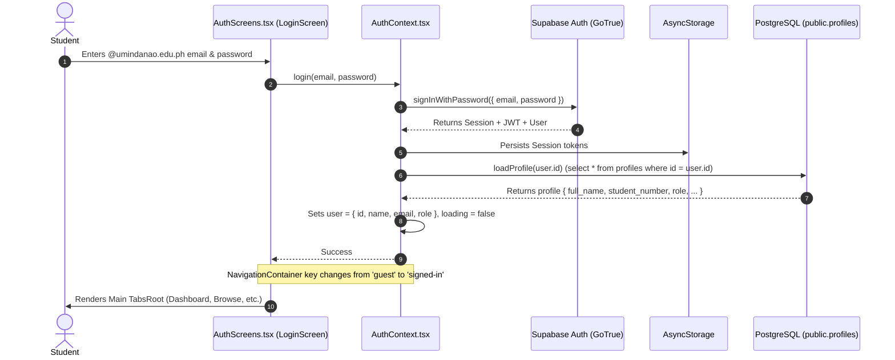

# UM-Pasa-Expo System Map (Refreshed)
**Project:** UM-Pasa (University of Mindanao Student Academic Resource Marketplace)  
**Target Client:** `UM-Pasa-Expo` (React Native Expo Mobile Application)  
**Author / Role:** Senior React Native Engineer  
**Status:** Refreshed Post-Round A Implementation (Pre-Demo Architecture Mapping — No Code Modifications)  

---

## 1. Stack and Setup

### Core Runtimes & Frameworks
| Dependency | Version in Codebase | Role / Note |
| :--- | :--- | :--- |
| **Expo SDK** | `^57.0.25` | Managed Expo workflow via `expo/AppEntry.js` entrypoint |
| **React Native** | `0.86.3` | Core mobile framework |
| **React** | `19.2.3` | Modern React runtime |
| **TypeScript** | `~6.0.3` | Strict type checking (`tsc --noEmit` passing with 0 errors) |
| **Node Engine** | `>=22.13.0` | Specified in `package.json` |

### Key Libraries
- **Navigation:** `@react-navigation/native` (7.1.0), `@react-navigation/native-stack` (7.3.0), `@react-navigation/bottom-tabs` (7.4.0), backed by `react-native-screens` (~4.26.0) and `react-native-safe-area-context` (~5.7.0).
- **Backend / Database Client:** `@supabase/supabase-js` (2.117.2) with `react-native-url-polyfill` (4.0.0). **Production backend is Supabase exclusively.**
- **Local Storage:** `@react-native-async-storage/async-storage` (2.2.0) used for Supabase session persistence and user theme preference storage. `expo-secure-store` (~57.0.4) installed for secure storage evaluation.
- **Date & Time Picker (UI-17):** `@react-native-community/datetimepicker` (9.1.0) with conditional native loading and web fallback.
- **UI & Media:** `expo-linear-gradient` (~57.0.2), `@expo/vector-icons` (Ionicons 15.0.3), `expo-image-picker` (~57.0.20), `expo-font` (~57.0.4), `expo-splash-screen` (~57.0.9).
- **Web Support:** `react-native-web` (0.21.2).

### State Management
1. **Authentication Context (`AuthContext`):** Root-level provider managing session tokens, authenticated user object, profile caching, login, registration, password updates, password resets, and account deletion.
2. **Theme Context (`ThemeContext`):** Dynamic theme mode state (`'light' | 'dark'`), persisted in `AsyncStorage` under key `'um-pasa-appearance'`, supplying design tokens (`ThemeTokens`).
3. **Local Component State:** Standard React `useState`, `useRef`, and `useCallback` for screen-level data, form inputs, pagination, debounce flags, and modal states.

### Environment & Configuration Handling
- Configuration is loaded via Expo's compile-time environment variables in `.env`:
  - `EXPO_PUBLIC_SUPABASE_URL`: Supabase project URL (e.g., `https://qtboywnuopgpgmspxxng.supabase.co`).
  - `EXPO_PUBLIC_SUPABASE_ANON_KEY`: Supabase anon/public JWT key.
- Initialized in `src/supabase.ts`.
- Validated via `supabaseConfigured`: Checks for non-null keys and guards against template placeholders (`YOUR_`).

---

## 2. Folder Structure

```
UM-Pasa-Expo/
├── assets/                          # Static branding, logo (UMPASALOGO.png), icons
├── src/
│   ├── api.ts                       # Facade re-exporting modules from services/
│   ├── database.types.ts            # Generated Supabase DB schema & RPC type definitions
│   ├── supabase.ts                  # Supabase client singleton with AsyncStorage storage
│   ├── auth/
│   │   ├── AuthContext.tsx          # AuthProvider, useAuth hook, session lifecycle
│   │   └── AuthScreens.tsx          # LoginScreen, RegisterScreen, password recovery card
│   ├── components/
│   │   └── common/
│   │       └── MeetupTimePicker.tsx # [NEW / UI-17] Cross-platform date & time picker modal
│   ├── theme/
│   │   ├── ThemeContext.tsx         # ThemeProvider, useTheme hook, theme toggle
│   │   └── tokens.ts                # Spacing, radius, typography, light/dark color palettes
│   ├── utils/
│   │   └── datetime.ts              # [NEW / UI-16] Shared Philippine Time (Asia/Manila) formatters
│   └── services/
│       ├── common.ts                # Error formatting, record assertion, public profile resolution
│       ├── items.ts                 # Marketplace listings queries, create/edit, remove, markSold
│       ├── transactions.ts          # Transaction lifecycle, request, approve, complete, rate
│       ├── messaging.ts             # Inbox, conversation thread, meetup proposal RPCs
│       ├── account.ts               # Student activity report, student dashboard aggregates
│       ├── admin.ts                 # Admin user directory, moderation, admin transactions
│       ├── notifications.ts         # User notification queries and read acknowledgments
│       ├── profiles.ts              # Public profile reviews, profile retrieval and updates
│       └── storage.ts               # Image & payment proof uploads (fetch blob -> ArrayBuffer)
├── supabase/                        # SQL setup scripts, RLS policies, functions, migrations
│   ├── complete_setup.sql           # Baseline consolidated schema, RLS, and primary RPCs
│   ├── fresh_database_setup.sql     # Alternative clean-slate initialization script
│   ├── master_repair.sql            # Idempotent repair script for permissions & triggers
│   ├── phase26_listing_sold.sql     # Phase 26: mark_listing_sold RPC definition
│   ├── phase27_workflows_and_reviews.sql # Phase 27: admin notify trigger, public_profile_reviews, meetup sync
│   └── seed_laravel_demo_data.sql   # Test seed records
├── App.tsx                          # Navigators, UI primitives, and 20 app screens
├── app.json                         # Expo app manifest (bundle identifiers, scheme, permissions)
├── CURRENT_STATE.md                 # [NEW] Pre-demo gap audit and risk dashboard
├── SYSTEM_MAP.md                    # [THIS FILE] System architectural map & inventory
├── eas.json                         # EAS build profiles (development, preview APK, production AAB)
├── package.json                     # Scripts and package manifests
└── tsconfig.json                    # TypeScript compiler options
```

---

## 3. Navigation Tree & Role Gating

### Navigation Architecture

```mermaid
graph TD
    Root[App.tsx: NavigationContainer] --> StackNav[AppStack: createNativeStackNavigator]
    
    subgraph GuestFlow["Guest Flow (Unauthenticated)"]
        StackNav -->|user == null| GuestBrowse[Browse: BrowseScreen]
        StackNav -->|user == null| Login[Login: LoginScreen]
        StackNav -->|user == null| Register[Register: RegisterScreen]
    end

    subgraph AuthFlow["Authenticated Flow (Student / Admin)"]
        StackNav -->|user != null| Main[Main: TabsRoot - createBottomTabNavigator]
        
        Main --> TabHome[Home: DashboardScreen]
        Main --> TabBrowse[Browse: BrowseScreen]
        Main --> TabMessages[Messages: MessagesScreen]
        Main --> TabTransactions[Transactions: TransactionsScreen]
        Main --> TabProfile[Profile: ProfileScreen]
        Main -->|user.role == 'admin'| TabAdmin[Admin: AdminScreen]
    end

    subgraph SharedModalStack["Shared Pushed Screens"]
        StackNav --> About[About: AboutScreen]
        StackNav --> Help[Help: HelpScreen]
        StackNav --> Listing[Listing: ListingScreen]
        StackNav --> ListingForm[ListingForm: ListingFormScreen]
        StackNav --> MyListings[MyListings: MyListingsScreen]
        StackNav --> Transaction[Transaction: TransactionScreen]
        StackNav --> Notifications[Notifications: NotificationsScreen]
        StackNav --> Conversation[Conversation: ConversationScreen]
        StackNav --> ProfileReviews[ProfileReviews: ProfileReviewsScreen]
        StackNav --> Reports[Reports: ReportsScreen]
    end

    subgraph AdminOnlyStack["Admin Dedicated Screens"]
        StackNav -->|isAdmin == true| AdminItems[AdminItems: AdminItemsScreen]
        StackNav -->|isAdmin == true| AdminUsers[AdminUsers: AdminUsersScreen]
        StackNav -->|isAdmin == true| AdminTransactions[AdminTransactions: AdminTransactionsScreen]
        StackNav -->|isAdmin == true| AdminReport[AdminReport: AdminReportScreen]
    end
```

The navigation root is wrapped by `<NavigationContainer key={user ? 'signed-in' : 'guest'}>`. When the auth state transitions between guest and signed-in, the navigation tree cleanly remounts to prevent stale stack history.



### Role & Access Gating Rules
1. **Guest (Unauthenticated):**
   - Can view the marketplace feed (`BrowseScreen`), search items, filter by department/category, view listing details (`ListingScreen`), and read `AboutScreen` and `HelpScreen`.
   - Cannot request items, post listings, message sellers, or view transactions. Tapping "Request item" or "Message seller" triggers a modal prompting sign in.
2. **Student (`role === 'student'`):**
   - Access to full bottom tabs: `Home` (student dashboard summary), `Browse`, `Messages`, `Transactions`, `Profile`.
   - Can post listings (`ListingForm`), edit own listings, request items, upload payment proof, participate in real-time messaging and meetup proposals, mark exchanges completed, submit ratings, view own activity reports, and delete own account.
   - Cannot see the `Admin` tab or access `AdminItems`, `AdminUsers`, `AdminTransactions`, or `AdminReport`.
3. **Admin (`role === 'admin'`):**
   - Inherits all student marketplace abilities.
   - Gains a 6th bottom tab: `Admin` (`AdminScreen`).
   - Pushed routes available: `AdminItems` (listing moderation review), `AdminUsers` (user directory), `AdminTransactions` (all platform transactions), and `AdminReport` (global activity metrics).
   - In `DashboardScreen`, the dashboard renders system-wide metrics (total users, active students, pending review counts, department distribution bar charts).

---

## 4. Screen Inventory

| Screen Name | File + Location | Primary Purpose | API / Service Calls | State Held | Components / Primitives Used |
| :--- | :--- | :--- | :--- | :--- | :--- |
| **BrowseScreen** | `App.tsx:44` | Marketplace item feed with auto-rotating banner carousel, 2-column grid, search, and category strips | `marketplace.list(filters)` | `items`, `loading`, `error`, `q`, `showFilters`, `filters`, `carouselIndex` | `Page`, `Card`, `LinearGradient`, `TextInput`, `ScrollView`, `Choice`, `Field`, `ItemCard`, `NotificationFab` |
| **ListingScreen** | `App.tsx:139` | Detailed listing view; includes UI-09 modal payment picker, requests item, initiates chat | `marketplace.get(id)`, `transactions.request()`, `messaging.send()`, `marketplace.remove()` | `item`, `busy`, `err`, `days`, `showPaymentModal`, `selectedPayment`, `otherPayment` | `Page`, `Heading`, `Image`, `Card`, `Field`, `Button`, `Modal`, `Alert`, `formatPhilippineDate` |
| **ListingFormScreen** | `App.tsx:412` | Create or edit a sale or rental listing with image picker and category dropdowns | `uploadItemImage()`, `marketplace.save()` | `f` (form values), `busy`, `imageUri` | `Page`, `Heading`, `Field`, `Choice`, `Image`, `Button`, `ImagePicker` |
| **DashboardScreen** | `App.tsx:457` | Role-based landing dashboard with quick actions (Add Listing / Review Listings) and metrics | `account.dashboard()`, `account.notifications()` (student) OR `admin.users()`, `admin.items()`, `admin.transactions()` (admin) | `data`, `err` | `Page`, `Heading`, `Button`, `Card`, `MiniBars`, `ItemCard`, `Pressable` |
| **TransactionsScreen** | `App.tsx:466` | List of user's active, pending, approved, and completed transactions | `transactions.list()` | `list`, `err`, `busy` | `Page`, `Heading`, `Pressable`, `Card`, `Status` |
| **TransactionScreen** | `App.tsx:470` | Detailed transaction view; proof upload, approval, UI-17 MeetupTimePicker, ratings | `transactions.get(id)`, `getPaymentProofSignedUrl()`, `uploadPaymentProof()`, `transactions.approve()`, `transactions.reject()`, `transactions.complete()`, `messaging.send()` | `t`, `err`, `meetup`, `meetupDate`, `uploadingProof`, `proofUrl`, `approving` | `Page`, `Heading`, `Card`, `Image`, `Button`, `Field`, `MeetupTimePicker`, `RatingForm`, `Alert`, `formatPhilippineDateTime` |
| **RatingForm** | `App.tsx:546` | 5-star rating and comment submission widget for completed transactions | `transactions.rate(id, rating, comment)` | `rating`, `comment`, `submitting` | `Card`, `Choice`, `Field`, `Button` |
| **MyListingsScreen** | `App.tsx:566` | Seller's inventory; review moderation status and mark items sold | `account.report()`, `marketplace.markSold()` | `items`, `err` | `Page`, `Heading`, `Button`, `ItemCard`, `Pressable`, `Alert` |
| **ProfileScreen** | `App.tsx:577` | View account metadata, theme toggle, update bio, change password, delete account | `useAuth().updateProfile()`, `useAuth().updatePassword()`, `useAuth().logout()`, `useAuth().deleteAccount()` | `name`, `studentNumber`, `department`, `program`, `password`, `confirm`, `busy`, `deleting` | `Page`, `Heading`, `Card`, `Field`, `Choice`, `Button`, `Alert` |
| **NotificationsScreen** | `App.tsx:647` | Activity notifications filterable by type; marks notifications read | `account.notifications()`, `account.markNotificationsRead()`, `account.markNotificationRead()` | `items`, `filter`, `err` | `Page`, `Heading`, `Button`, `Choice`, `Card`, `Pressable` |
| **MessagesScreen** | `App.tsx:649` | User's conversation list with buyers/sellers | `messaging.list()` | `rows`, `err` | `Page`, `Heading`, `Card`, `Pressable`, `Status` |
| **ConversationScreen** | `App.tsx:650` | Real-time chat thread with speech bubbles, UI-17 MeetupTimePicker, partner profile tap | `messaging.get()`, `messaging.send()`, `messaging.respond()`, Supabase realtime subscription | `c`, `body`, `location`, `meetupDate`, `sending`, `proposing` | `Page`, `Pressable`, `TextInput`, `Button`, `Card`, `Field`, `MeetupTimePicker`, `Ionicons`, `formatPhilippineDateTime` |
| **ReportsScreen** | `App.tsx:741` | Filterable summary of personal listings, earnings, and transaction history | `account.report()` | `d`, `err`, `status`, `type`, `category`, `sort` | `Page`, `Heading`, `Card`, `Choice`, `Status`, `formatPhilippineDate` |
| **AboutScreen** | `App.tsx:755` | Institutional mission, dev team, and department attribution | None (Static) | None | `Page`, `Heading`, `Card` |
| **HelpScreen** | `App.tsx:756` | Transaction workflow, campus safety guidelines, and payment instructions | None (Static) | None | `Page`, `Heading`, `Card` |
| **ProfileReviewsScreen**| `App.tsx:758` | Displays public exchange rating history and reviews for a specific user | `profiles.reviews(id)` | `reviews`, `error`, `loading` | `Page`, `Heading`, `Card`, `Status`, `formatPhilippineDate` |
| **AdminScreen** | `App.tsx:757` | Admin gateway menu linking to review, user list, and platform metrics | None (Navigation router) | None | `Page`, `Heading`, `Button` |
| **AdminItemsScreen** | `App.tsx:759` | Admin moderation queue; approve or reject items with mandatory reason | `admin.items()`, `admin.moderate()` | `rows`, `err`, `busy`, `expandedId`, `rejectionTarget`, `rejectionReason` | `Page`, `Heading`, `Card`, `Image`, `Button`, `Field` |
| **AdminUsersScreen** | `App.tsx:779` | Administrator directory of registered students and staff | `admin.users()` | `rows`, `err`, `busy` | `Page`, `Heading`, `Card`, `Status` |
| **AdminTransactionsScreen** | `App.tsx:781` | Comprehensive audit trail of all campus transactions | `admin.transactions()` | `rows`, `err`, `busy`, `expandedId` | `Page`, `Heading`, `Card`, `TransactionSummary` |
| **AdminReportScreen** | `App.tsx:782` | University-wide metrics with filters by type, status, and category | `admin.items()`, `admin.transactions()` | `items`, `txs`, `err`, `busy`, `status`, `type`, `category`, `sort`, `expandedTxId` | `Page`, `Heading`, `Card`, `Choice`, `Status`, `TransactionSummary` |
| **LoginScreen** | `src/auth/AuthScreens.tsx:54` | Student sign in with `@umindanao.edu.ph` email; password recovery | `useAuth().login()`, `useAuth().resetPassword()` | `email`, `password`, `busy`, `error`, `showForgot`, `forgotEmail`, `forgotBusy`, `forgotMsg` | `AuthLayout`, `AuthField`, `SubmitButton`, `Pressable`, `Text` |
| **RegisterScreen** | `src/auth/AuthScreens.tsx:115` | Student account registration enforcing institutional domain | `useAuth().register()` | `fullName`, `studentNumber`, `email`, `password`, `confirm`, `busy`, `error`, `success` | `AuthLayout`, `AuthField`, `SubmitButton`, `Pressable`, `Text` |

---

## 5. API & Backend Integration Layer

### Confirmed Production Backend Architecture: Supabase Only
The mobile application's production backend is **Supabase exclusively**. It does not communicate with Laravel or Sanctum. All database queries, mutations, authentication routines, and file uploads are handled via `@supabase/supabase-js` targeting PostgreSQL tables, RPC functions, and Supabase Storage buckets.

### Full Inventory of Supabase Database Operations in Codebase

#### 1. Stored Procedures (`supabase.rpc`)
| RPC Function Name | Code Call Location | Arguments Passed | Migration Source | Status / Cross-Check Note |
| :--- | :--- | :--- | :--- | :--- |
| **`save_listing`** | `src/services/items.ts:121` | `{ p_item_id, p_data }` | `complete_setup.sql:450` | Present in baseline SQL & types. |
| **`delete_listing`** | `src/services/items.ts:140` | `{ p_item_id }` | `complete_setup.sql:520` | Present in baseline SQL & types. |
| **`mark_listing_sold`** | `src/services/items.ts:151` | `{ p_item_id }` | `phase26_listing_sold.sql:5` | **Requires Phase 26 migration on live DB.** |
| **`request_item`** | `src/services/transactions.ts:88` | `{ p_item_id, p_payment_method, p_other_payment_method, p_rental_duration_days }` | `complete_setup.sql:581` | Present in baseline SQL & types. |
| **`approve_transaction`**| `src/services/transactions.ts:109`| `{ p_transaction_id, p_meetup_location, p_meetup_time }` | `complete_setup.sql:620` | Present in baseline SQL & types. Accepts ISO timestamp. |
| **`reject_transaction`** | `src/services/transactions.ts:123`| `{ p_transaction_id }` | `complete_setup.sql:660` | Present in baseline SQL & types. |
| **`complete_transaction`**| `src/services/transactions.ts:133`| `{ p_transaction_id }` | `complete_setup.sql:690` | Present in baseline SQL & types. Sets item to sold. |
| **`rate_transaction`** | `src/services/transactions.ts:143`| `{ p_transaction_id, p_rating, p_comment }` | `complete_setup.sql:720` | Present in baseline SQL & types. Stored in `ratings`. |
| **`send_message`** | `src/services/messaging.ts:98` | `{ p_conversation_id, p_recipient_id, p_item_id, p_body, p_type, p_meetup_location, p_meetup_time }` | `complete_setup.sql:770` | Present in baseline SQL & types. |
| **`respond_to_meetup_proposal`** | `src/services/messaging.ts:121` | `{ p_message_id, p_accept }` | `phase27_workflows_and_reviews.sql:52` | Baseline version only updates message; **Phase 27 updates transaction schedule.** |
| **`admin_list_profiles`** | `src/services/admin.ts:19` | `{}` | `complete_setup.sql:870` | Present in baseline SQL & types. |
| **`set_item_moderation`** | `src/services/admin.ts:31` | `{ p_item_id, p_status, p_rejection_reason }` | `complete_setup.sql:553` | Present in baseline SQL & types. |
| **`public_profile_summaries`** | `src/services/common.ts:40` | `{ p_ids }` | `complete_setup.sql:900` | Present in baseline SQL & types. |
| **`public_profile_reviews`** | `src/services/profiles.ts:7` | `{ p_user_id }` | `phase27_workflows_and_reviews.sql:28` | **Requires Phase 27 migration on live DB.** |
| **`delete_user_account`**| `src/auth/AuthContext.tsx:202`| `{}` | Unversioned / Console | Declared in `database.types.ts:141`, but **missing from repository SQL files**. |

#### 2. Direct Table Operations (`supabase.from`)
- **`profiles`:**
  - `select('*').eq('id', user.id).single()` (`AuthContext.tsx:32`, `profiles.ts:25`)
  - `update(payload).eq('id', authUser.id)` (`AuthContext.tsx:173`)
  - `update({ role }).eq('id', id)` (`admin.ts:49`)
- **`items`:**
  - `select('*').is('archived_at', null)...` (`items.ts:34`, `admin.ts:26`)
  - `select('*').eq('id', id).single()` (`items.ts:87`)
  - `select('*').eq('seller_id', user.id).is('archived_at', null)` (`items.ts:102`)
- **`transactions`:**
  - `select('*').or(...)` (`transactions.ts:31`, `admin.ts:44`)
  - `select('*').eq('id', id).single()` (`transactions.ts:60`)
  - `update({ payment_proof_path, payment_proof_uploaded_at }).eq('id', transactionId)` (`transactions.ts:167`)
- **`conversations`:**
  - `select('*').or(...)` (`messaging.ts:23`)
  - `select('*').eq('id', id).single()` (`messaging.ts:51`)
- **`messages`:**
  - `select('*').eq('conversation_id', conversationId).order('created_at', { ascending: true })` (`messaging.ts:62`)
- **`notifications`:**
  - `select('*').eq('user_id', user.id).order('created_at', { ascending: false }).limit(50)` (`notifications.ts:12`)
  - `update({ is_read: true }).eq('id', id).eq('user_id', user.id)` (`notifications.ts:25`)
  - `update({ is_read: true }).eq('user_id', user.id).eq('is_read', false)` (`notifications.ts:34`)
- **`ratings`:**
  - `select('*').eq('transaction_id', id)` (`transactions.ts:69`)

#### 3. Storage Buckets
- **`items`:** Public bucket for marketplace listing photographs (`storage.ts:14`).
- **`payment-proofs`:** Authenticated bucket with signed URL retrieval for non-cash payment receipts (`storage.ts:28`, `transactions.ts:64`).

---

## 6. Authentication Flow



---

## 7. Audit & Fix Status (Tracking Previous Rounds)

| Audit Item | Description | Current Status | Implemented Changes |
| :--- | :--- | :---: | :--- |
| **UI-09** | Replace multi-button Alert payment picker | **FIXED** | Replaced with an in-app bottom sheet modal with radio-style payment selection in `ListingScreen` (`App.tsx:311-391`). |
| **UI-16** | Shared Philippine Time formatter | **FIXED** | Created `src/utils/datetime.ts` with `formatPhilippineDateTime` and `formatPhilippineDate` (`Asia/Manila`, `en-PH`) and integrated across all screens. |
| **UI-17** | Replace typed meetup time input with Date/Time picker | **FIXED** | Created `MeetupTimePicker` (`@react-native-community/datetimepicker` 9.1.0) with iOS modal, Android 2-step date/time flow, and web fallback. Converted to ISO-8601 strings. |
| **Type Fix**| Property 'palettes' does not exist error | **FIXED** | Added `palettes` mapping object in `App.tsx:22` resolving the crash in `ThemedApp`. |
| **UI-23** | Chat composer pinning above keyboard | **OPEN** | Composer is currently placed at the bottom of the scrollable view; requires keyboard offset pinning and auto-scroll logic. |
| **UI-11** | Keyboard handling in long forms | **OPEN** | `ListingFormScreen` needs automatic scroll-to-focused-input handling. |
| **UI-13** | Text spinner vs skeleton loading | **OPEN** | Text-only loading placeholders ("Loading listing…") remain in several screens. |
| **UI-15** | Empty vs loading state flashes | **OPEN** | Screens can briefly flash empty states while data queries resolve. |
| **UI-19** | Dark/light mode hardcoded colors in AuthScreens | **OPEN** | `AuthScreens.tsx` retains static palette constants independent of `ThemeContext`. |

---

## 8. Things That Cannot Be Verified Statically

The following items cannot be determined solely through code inspection and require a physical test device or live Supabase database access:

1. **Live Supabase Schema Catalog:** Whether `phase26_listing_sold.sql`, `phase27_workflows_and_reviews.sql`, and `delete_user_account` are currently deployed on the active remote PostgreSQL instance.
2. **Dynamic Island Notch Clipping:** Whether native stack headers or custom screen headers experience pixel-level overlap with the Dynamic Island pill on iPhone 14 Pro, 15, and 16 hardware.
3. **Android Hardware Navigation Bar:** Whether device-specific navigation bars (e.g. Samsung 3-button bar vs gesture indicator) overlap the bottom tab bar on small Android screens.
4. **Camera Upload Throughput & OOM Behavior:** Real-world upload duration and memory impact when uploading uncompressed 48MP camera images over mobile network.
5. **Supabase Realtime WebSocket Push Latency:** Live WebSocket message propagation delay across physical cellular carrier networks during chat demonstrations.
